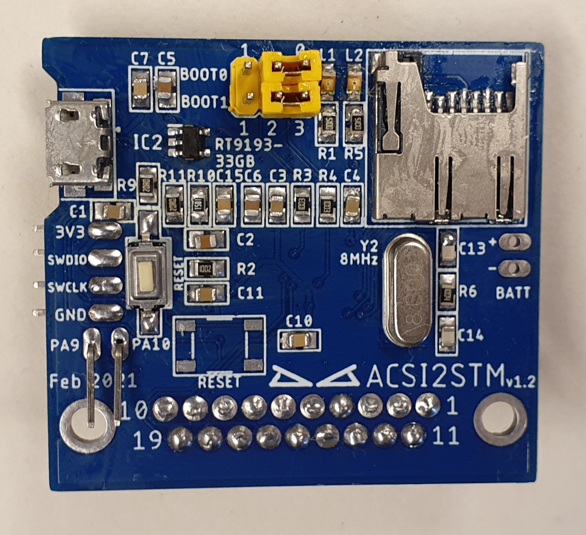
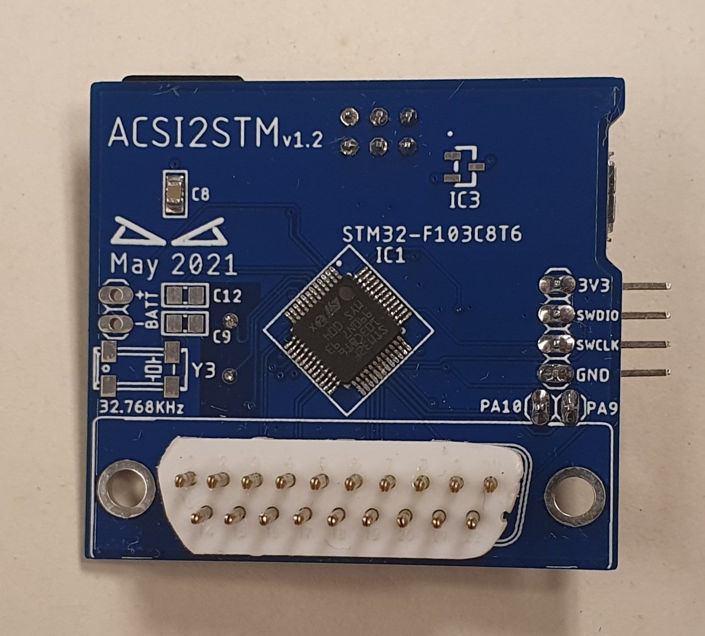
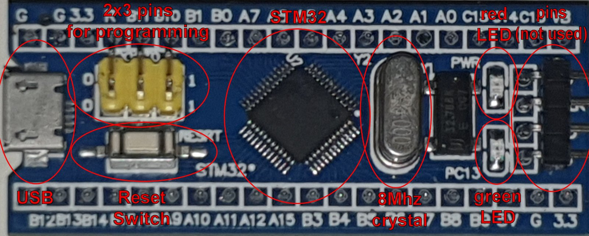
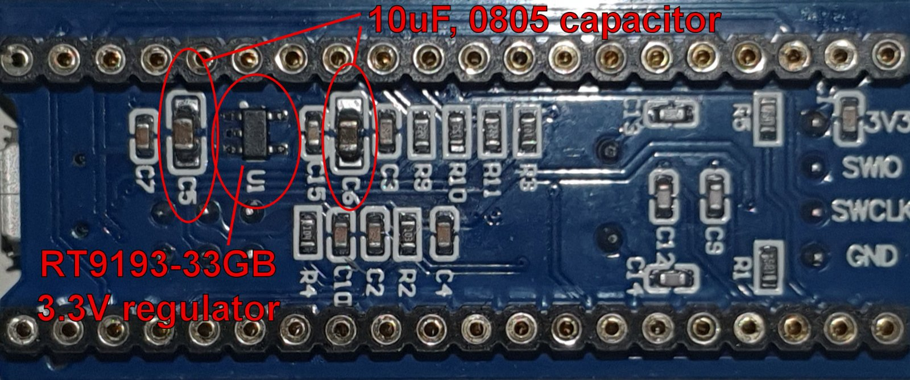
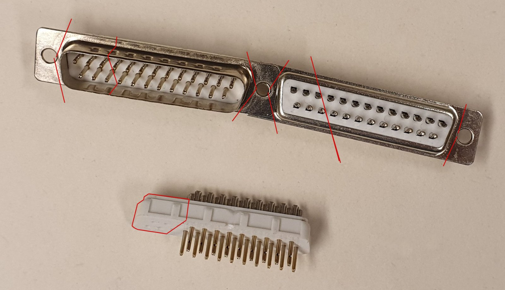
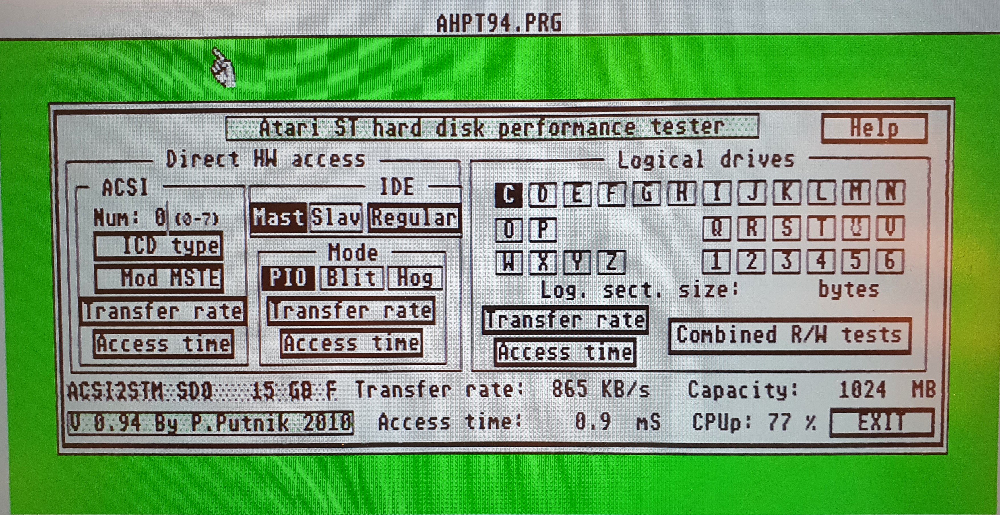

<h1 align="center">
PCB for combining bluepill, microSD card reader and DB19 connector
</h1>

---

## History

This PCB was only made for me and the goal was to get a small PCB made with everything on it. A few people asked if I could make it public. So it is a "work in progress". There is no way to change ID at the moment, but I have plans to make a new PCB to change ID on the unit between 0-4. Right now the ID is fixed to ID0. There is also some components not needed for this project but was present on the bluepill. So download the zip with the gerbers and order your board from your favourite PCB manufactor. 

---

## "bluepill"

<h1 align="center">
 
 
</h1>
 
- Some parts can be be used from the [bluepill] board. Most of the passive part on the [bluepill] is 0603 and although they could have been used on the new board, I opted to use 0805 for everything for easier soldering. They are cheap anyway. If you program the STM32 on the [bluepill] board before you desolder it you can leave the 4 pins.
  * USB connector can probably fit on the new board. But you have to cut of the small plastic pegs underneath. I used new connector on mine.
  * 8MHz crystal.
  * 2x3 pinheader (and associated jumper).
  * Red and yellow LED. I used new LED on mine (green for power (L1) and yellow for activity(L2)).
  * Right angle pins. Only used for programming. 
  * Reset switch. There is two different version depending on bluepill model. Only use one on the new board.
  * STM32.
  * LDO 5V to 3.3V regulator.
  * 10uF capacitors.

---

## Howto

-  Use only one 3.3V LDO regulator. If you don't use the LDO from the bluepill there is a SOT-23 footprint on the other side (IC3) that can be used. 
- Battery connector, 32,768KHz crystal (Y3), capacitor is not used (C9 and C12).
- For programming the STM32 use the `3V3`, `GND`, `PA9` and `PA10` with a [FTDI programmer] (with 3V3 on VCC pin). Set `BOOT0` to 1 with the jumper. Reset switch is probably of use as well when programming. Download [STM32CubeProgrammer] and upload the v2.1 [binary] firmware to the STM32.
- I made the PCB to use 19 pin D-SUB connector and solder it directly into the PCB. They can be pricy to get hold of so I made my own out of 25 pin D-SUB connector insted. The solder end don't go that far into the PCB so don't force it in and try to get it flush. There should be a gap.

---

## Speed test

I used [AHPT] by P.Putnik to test the units speed. Here you can download [AHPT94.ZIP] directly.

---

Bill of material for this is listed in the `ACSI2STM vx.x BOM.txt`

PCB made by [DoG] in Eagle v9.6.2.

[bluepill]: https://stm32-base.org/boards/STM32F103C8T6-Blue-Pill.html
[FTDI programmer]: https://www.google.com/search?q=FTDI+programmer&tbm=isch&ved=2ahUKEwjl8Pi_q_nyAhXxlosKHXmeC9EQ2-cCegQIABAA&oq=FTDI+programmer&gs_lcp=CgNpbWcQAzIFCAAQgAQyBQgAEIAEMgUIABCABDIFCAAQgAQyBQgAEIAEMgQIABBDMgUIABCABDIGCAAQBxAeMgYIABAHEB4yBggAEAcQHjoGCAAQBRAeOgQIABAYUNs_WK1QYM9TaABwAHgAgAFQiAGFAZIBATKYAQCgAQGqAQtnd3Mtd2l6LWltZ8ABAQ&sclient=img&ei=juU9YeXxEPGtrgT5vK6IDQ&bih=660&biw=1818&hl=en
[binary]: binary/acsi2stm.v2.1.ino.generic_stm32f103c.bin
[STM32CubeProgrammer]: https://www.st.com/en/development-tools/stm32cubeprog.html
[AHPT]: https://atari.8bitchip.info/ahpt.html
[AHPT94.ZIP]: https://atari.8bitchip.info/AHPT9.ZIP
[DoG]: https://www.exxoshost.co.uk/forum/memberlist.php?mode=viewprofile&u=255

